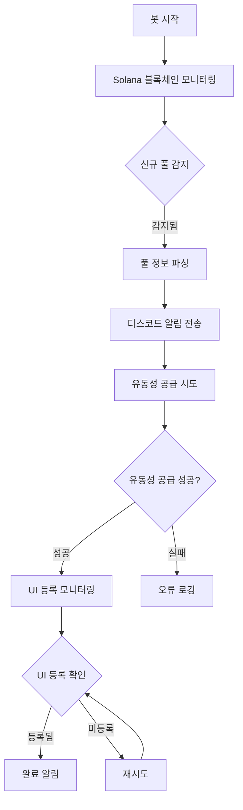

# 🚀 Meteora UI 딜레이 차익거래 봇

Meteora에서 신규 풀 생성 직후, UI에 반영되기 전 시간차를 활용해 컨트랙트 상에서 유동성을 빠르게 공급하고 초기 수수료 및 인센티브를 선점하는 자동화 전략형 봇입니다.

## 📋 주요 기능

- 실시간 Solana 블록체인 모니터링을 통해 Meteora 신규 풀 감지
- 신규 풀 생성 시 자동으로 유동성 공급
- Jupiter, Meteora UI에 풀이 등록되었는지 확인
- 디스코드를 통한 실시간 알림
- 안정적인 오류 처리 및 자동 재연결

## 🔄 기능 흐름도



## 📊 상세 프로세스

1. **초기화 단계**
   - Solana RPC 연결 설정
   - 지갑 계정 로드
   - WebSocket 구독 설정

2. **모니터링 단계**
   - Meteora 프로그램 로그 실시간 감시
   - `create_pool` 트랜잭션 필터링
   - 풀 생성 이벤트 감지

3. **풀 정보 처리**
   - 트랜잭션 데이터 파싱
   - 풀 주소 추출
   - 토큰 페어 정보 확인

4. **유동성 공급**
   - 토큰 잔액 확인
   - 유동성 공급량 계산
   - 트랜잭션 생성 및 전송

5. **UI 등록 확인**
   - Jupiter API 확인
   - Meteora API 확인
   - 등록 상태 모니터링

6. **알림 및 로깅**
   - 디스코드 실시간 알림
   - 로그 파일 기록
   - 오류 처리 및 보고

## 🛠️ 설치 방법

1. 저장소 클론:
```bash
git clone https://github.com/yourusername/meteora-ui-delay-arb-bot.git
cd meteora-ui-delay-arb-bot
```

2. 의존성 설치:
```bash
npm install
```

3. 환경 변수 설정:
```bash
cp dot.env .env
```
`.env` 파일을 열고 다음 값들을 설정하세요:
- `PRIVATE_KEY`: Solana 지갑 비공개 키
- `RPC_ENDPOINT`: Solana RPC 엔드포인트 URL
- `DISCORD_WEBHOOK_URL`: 알림을 받을 디스코드 웹훅 URL

## 🚀 사용 방법

### 개발 모드 실행
```bash
npm run dev
```

### 프로덕션 모드 실행
```bash
npm start
```

## ⚠️ 주의사항

- 실제 자금을 사용하기 전에 테스트넷에서 충분히 테스트하세요.
- 비공개 키와 같은 민감한 정보는 항상 `.env` 파일에 안전하게 보관하고, 절대 공개 저장소에 커밋하지 마세요.
- 이 봇은 교육 및 참고 목적으로 제공됩니다. 실제 운영에 사용할 경우 모든 책임은 사용자에게 있습니다.

## 🧩 프로젝트 구조

```
meteora-ui-delay-arb-bot/
│
├── src/
│   ├── monitor/
│   │   ├── watchNewPools.js         # 신규 풀 생성 감지
│   │   └── parsePoolTx.js           # 풀 생성 트랜잭션 파싱
│   │
│   ├── bot/
│   │   ├── supplyLiquidity.js       # 유동성 공급
│   │   └── checkPoolListed.js       # UI 반영 여부 확인
│   │
│   ├── utils/
│   │   ├── logger.js                # 로깅
│   │   ├── notify.js                # 디스코드 알림
│   │   └── constants.js             # 상수 및 설정
│   │
│   └── index.js                     # 메인 실행 파일
│
├── .env                             # 환경 변수
└── package.json                     # 의존성 관리
```

## 📜 라이센스

MIT 

## ⚙️ 설정 파라미터

```javascript
// constants.js의 주요 설정값
const MONITORING = {
  POLLING_INTERVAL: 2000,        // 풀링 간격 (ms)
  WS_RECONNECT_INTERVAL: 5000    // 재연결 간격 (ms)
};

const LIQUIDITY = {
  MIN_SOL_BALANCE: 0.1,          // 최소 SOL 잔액
  MAX_LP_PERCENTAGE: 80,         // 최대 투입 비율 (%)
  SLIPPAGE: 1                    // 슬리피지 허용치 (%)
};
```

## 🔍 모니터링 지표

- 풀 감지 성공률
- 유동성 공급 성공률
- UI 등록 소요 시간
- 트랜잭션 수수료
- 수익성 지표 